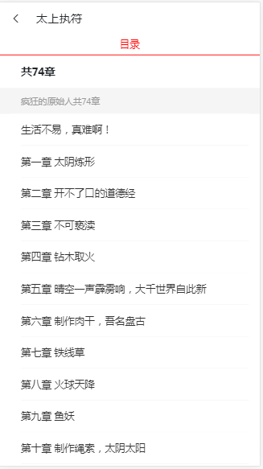
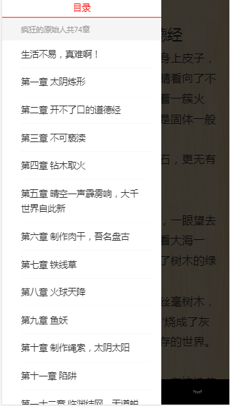

# Read
## 一.技术栈：vue全家桶+vant+express（没用使用数据库，纯读取文件）
## 二.目录说明：小说文件放在两个文件夹，books存放小说主题，ifo存放小说信息
  - 因为小说是从起点中文网爬下来的，所以没有按顺序排列章节，造成了很大不便（后面通过排序搞定了）
  - 书架用的localstorage，所以清缓存书架会清空掉
  - 为什么不用某书神器的接口？
    - 没有打算做完整（网上同类型的项目太多了），大家需要的话可以对接
    - ```
      //附上追书神器的api接口
      https://github.com/zimplexing/vue-nReader/blob/master/doc/zhuishushenqi.md
      ```
## 三.功能：主要是为了尝试使用jsonp实现跨域，功能没完善（排行榜分类什么的没做）
  - 已完成的功能：
    - 1.读小说
    - 2.下拉加载下一章
    - 3.上拉加载上一章
    - 4.夜间模式
    - 5.目录
    - 6.书架
## 四.运行说明：
  192.168.191.1是本地局域网地址，可以在同局域网内手机访问
  - 1.
      ```
      npm i 
      ```
  - 2.
      ``` 
      // server目录下开启服务器(http://192.168.191.1:8000)
      cd server
      nodemon app.js
      ```
  - 3.
      ```
      // 根目录下开启webpack(http://192.169.191.1.3000)
      npm run dev
      ```
## 五.收获与总结：
  - 1.学习了jsonp的简单使用吧，感觉还不错，比起之前直接配置代理跨域简便不少
    - jsonp不支持post方法，不过用来获取资源还行
  - 2.重排中文章节的问题，主要思路就是先提取中文数字子串 -> 转为阿拉伯数字 -> 构建排序对象结构 -> 根据key排序 -> 获取到重排后的数组
    - 自己写的中文转换数字算法似乎有点漏洞，最后还是采用了一个包（包名叫nzh）
  - 3.关于promise的使用，爬小说和读取文件都需要用到不少异步操作
    - 好处：提高代码可读性，不用搞那么多回调嵌套，避免了读取不到的问题
    - ps：试图从then里面往外面return值，但是这是行不通的，外界无法访问该返回值
      - 正确用法就是通过resolve传递值，返回一个promise就行了
  - 4.vue-router命名路由真的很好用哦
    - 同一路由下数据不刷新的解决办法：1.watch监听router 2.官方新的api，导航守卫```https://router.vuejs.org/zh/guide/advanced/navigation-guards.html```
## 六.运行截图
  
  
  
  
  
  
  
  

