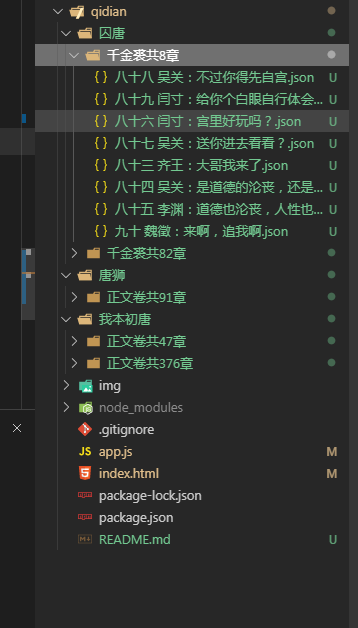

## 起点小说网的小说爬取
#### 本来想一次爬很多本的，但是效果很慢。而且出错的话重新来比较麻烦
#### 暂时实现了单本的爬取
#### - 使用：
        - npm i
        - node app.js
        - //在浏览器打开index.html,输入要爬取的小说主页地址（起点中文网）
        依次点击创建目录结构和写入内容（注意：顺序不能反）
#### 截图：

